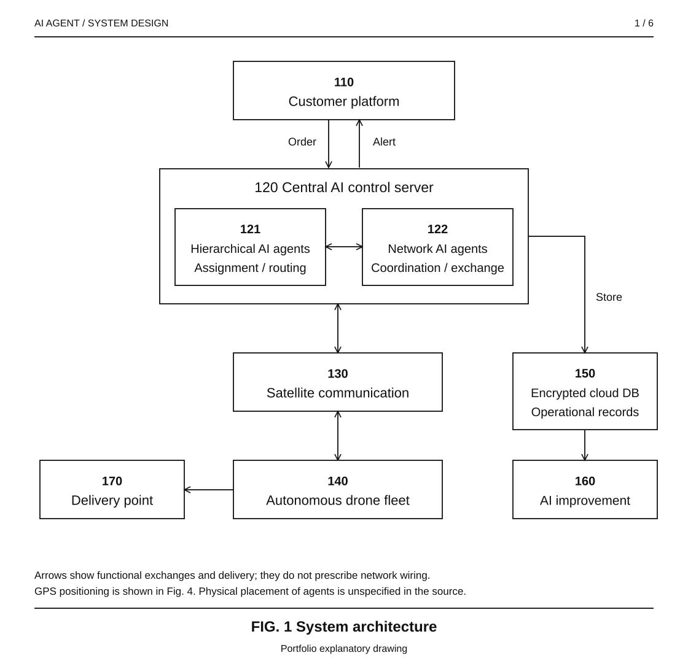
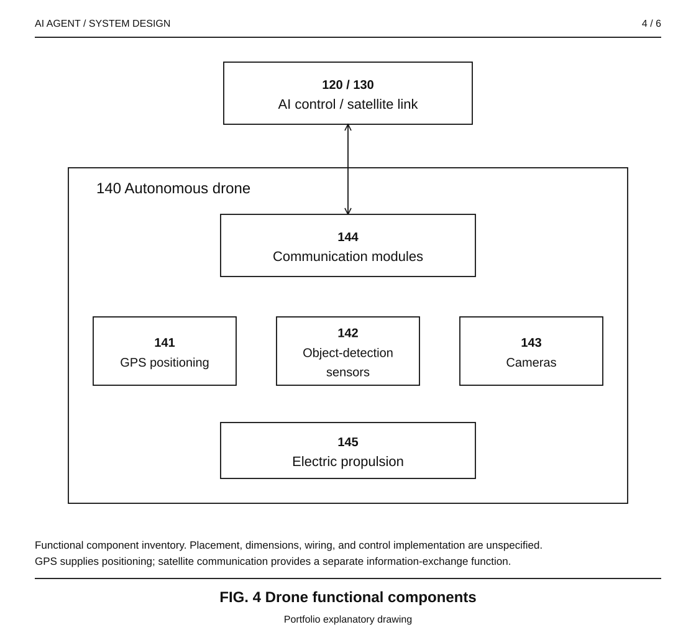
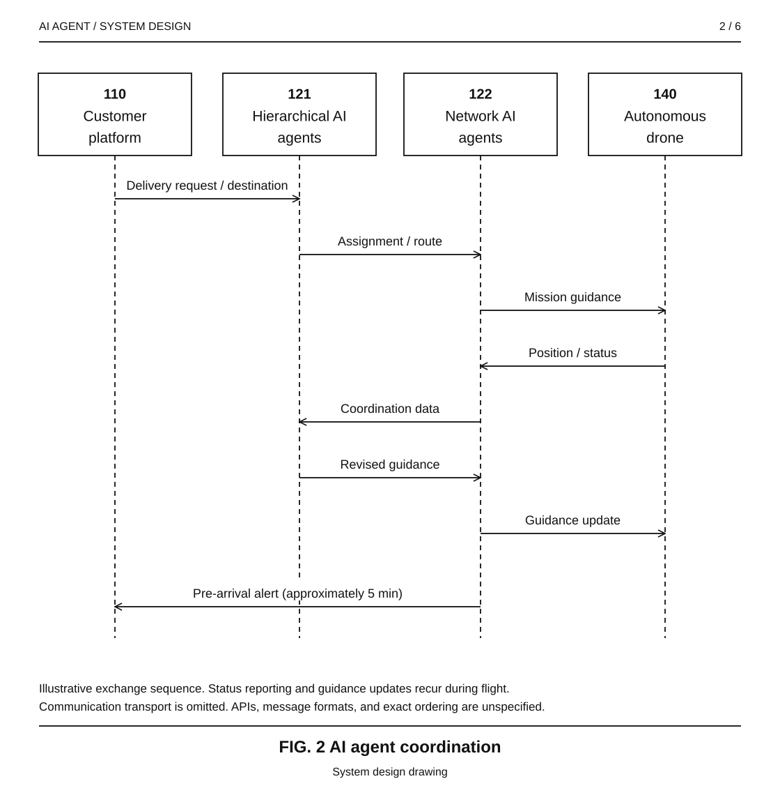
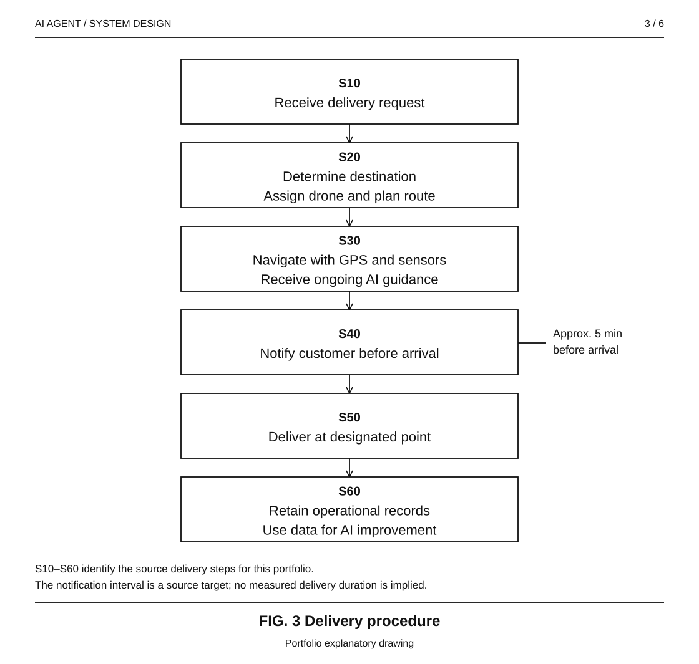
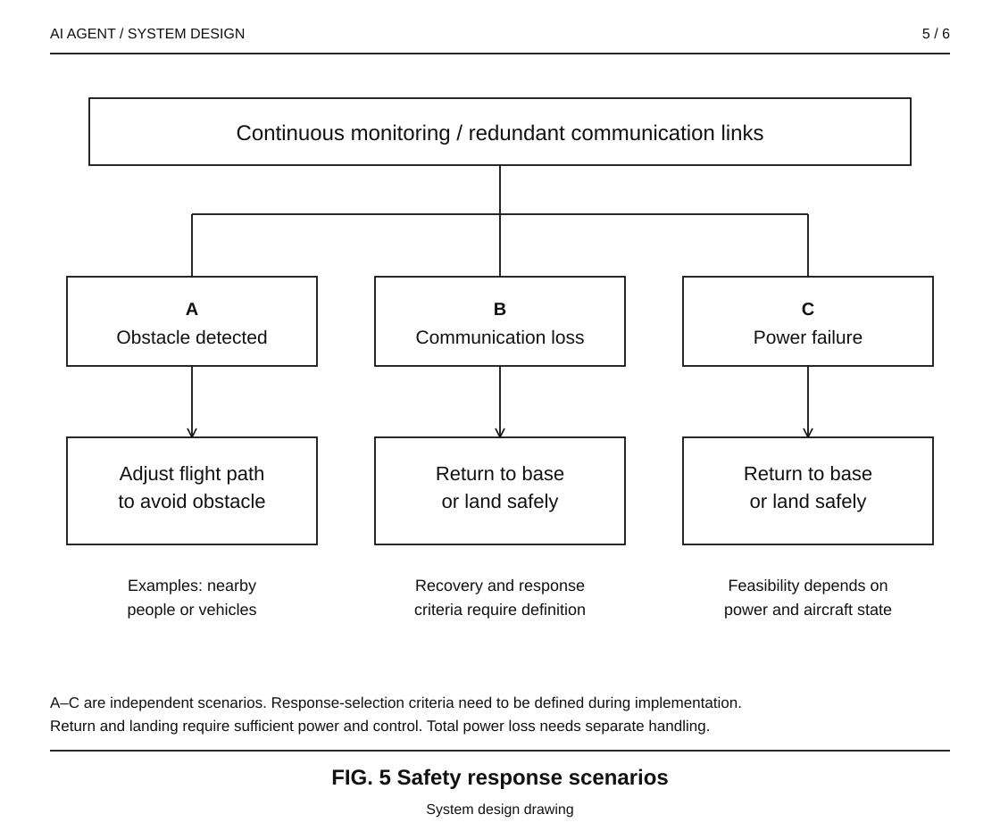
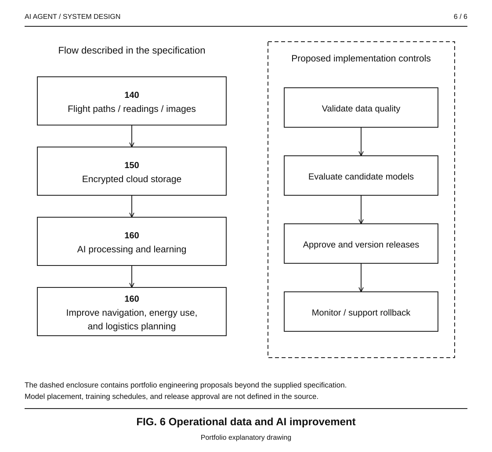

# AI Agent & System Design

**Autonomous Drone Delivery Patent**

**Language:** English | [日本語](japanese-readme.md)

**Granted patent · South Africa · CIPC 2025/09550 · 28 January 2026**

*Six technical drawing sheets, available in English and Japanese. [Drawing index and reference numerals](assets/README.md).*

**Visual walkthrough:** [Architecture](#multi-agent-system-architecture) · [Agent coordination](#how-the-agents-coordinate) · [Delivery lifecycle](#delivery-lifecycle) · [Safety and learning](#safety-security-and-learning)

## Project summary

- **Problem:** Delivery across dense cities, mountainous areas, and dispersed communities requires fleet coordination, changing route decisions, reliable communication, and a clear customer handoff.
- **What I designed:** An autonomous drone delivery system combining hierarchical AI agents for fleet scheduling and routing, network AI agents for coordination and information exchange, and drones equipped with GPS, sensors, cameras, and communication modules.
- **Outcome:** Granted patent **ZA202509550B**, connecting multi-agent AI, autonomous navigation, customer notifications, and operational data reuse into one system design. Published on **28 January 2026**; see the [patent record](docs/patent-record.md).
- **My role:** I developed the invention and authored the patent specification, defining the agent responsibilities, delivery workflow, communications requirements, safety behavior, and potential extensions.
- **Review:** Start with the architecture below, then inspect the [design analysis](docs/system-design.md), [claim-to-design map](docs/claim-map.md), and [provided specification](source/specification.txt).

**Portfolio focus:** Multi-agent architecture · autonomous systems · system design · invention development · technical writing

## Granted patent

**Artificial Intelligence-Based Smart Drone Delivery System Using AI Multi-Agent Technology.**

| Patent information | Record |
|---|---|
| Office / jurisdiction | CIPC · South Africa |
| Patent number | 2025/09550 |
| Publication number | ZA202509550B |
| Filing / priority date | 11 November 2025 |
| Grant / registration date | 28 January 2026|
| Publication date | 28 January 2026, indexed by Google Patents |

## Invention at a glance

| Dimension | Design |
|---|---|
| Application | Autonomous parcel delivery |
| Geographic context | South Korea, Japan, and China |
| Coordination | Hierarchical fleet management and network-agent cooperation |
| Drone capabilities | GPS positioning, sensors, cameras, autonomous navigation, electric propulsion |
| Connectivity | Satellite communication with encrypted and authenticated exchanges |
| Customer experience | Order placement, location-aware assignment, arrival alert, designated delivery point |
| Data lifecycle | Flight paths, sensor readings, and images stored for subsequent AI improvement |
| Published material | Technical case study, architecture diagrams, source specification, and claim mapping |

The supplied material describes the invention and its intended behavior. Flight trials, deployed software, and measured cost or emissions results are outside the evidence supplied for this portfolio.

## Problem and design objectives

The specification frames logistics as a coordination problem across three environments: dense urban areas, mountainous or rural communities, and geographically dispersed delivery destinations. A useful system must connect decisions at fleet level with conditions encountered by an individual drone.

| Design objective | Mechanism in the specification | Intended value |
|---|---|---|
| Coordinate fleet resources | Hierarchical agents schedule drones and determine routes | More consistent assignment and fleet management |
| Adapt to changing conditions | AI agents update paths using traffic, weather, and environmental data | Responsive navigation |
| Keep participants informed | Network agents exchange information among drones, the control center, and customers | Delivery visibility and coordinated operations |
| Make receipt predictable | Text or app notification approximately five minutes before arrival | Time for the customer to prepare for receipt |
| Extend delivery access | Autonomous electric drones and designated delivery points | Service options for difficult-to-reach locations |
| Improve future operations | Retain operational data for learning and optimization | Better-informed navigation and logistics planning |

These are design objectives; their operational value requires measurement in a future implementation.

## Multi-agent system architecture

The architecture combines a central AI control server with two complementary agent responsibilities:

| Component | Responsibility | Main information handled |
|---|---|---|
| **Hierarchical AI agents** | Fleet control, drone assignment, scheduling, routing, and coordination | Delivery requests, drone availability, destinations, route decisions |
| **Network AI agents** | Communication, data exchange, and cooperation among drones, the control center, and customers | Status updates, coordination information, and customer messages |
| **Autonomous drones** | Execute navigation and delivery; detect obstacles and respond to local conditions | GPS coordinates, sensor readings, camera images, and flight status |
| **Customer platform** | Accept orders and deliver text/app alerts | Delivery requests, destination information, and arrival notifications |
| **Operational data store** | Retain delivery information in an encrypted cloud database for AI improvement | Flight paths, sensor readings, and images |

The agent categories describe responsibilities. The specification does not define their process placement, communication protocol, or a fully decentralized consensus mechanism. Here, “multi-agent AI” refers to the described autonomous logistics architecture; the source does not specify an LLM framework.

<strong>FIG. 4 — Drone functional components</strong>

Reference numerals 141–145 identify the components described in the specification. This functional inventory leaves physical placement, wiring, and mechanical design unspecified.

### How the agents coordinate

Hierarchical agents determine assignments and routes. Network agents carry coordination information between participants. The drone reports its position and status so guidance can be updated during delivery. This sequence illustrates responsibilities and information flow.

### Delivery lifecycle

1. **Request:** The customer places an order through the connected delivery platform.
2. **Assign:** The AI system determines the destination, selects an available drone, and plans the route.
3. **Navigate:** The drone uses GPS, sensors, and satellite communication while the AI system updates guidance as conditions change.
4. **Notify:** The customer receives a text or app alert approximately five minutes before arrival.
5. **Deliver:** The parcel is received at a predefined delivery point, such as a designated ground-level zone or window.
6. **Learn:** Flight paths, sensor data, and images are retained for later improvements to navigation, energy efficiency, and logistics planning.

The five-minute interval is an arrival-notification target in the specification, rather than a measured delivery duration. Physical release and recipient-verification mechanisms are not specified.

## System design decisions and trade-offs

| Decision | Why it matters | Engineering question for implementation |
|---|---|---|
| Separate fleet control from network cooperation | Makes scheduling and communication responsibilities explicit | How are conflicting or stale commands resolved? |
| Combine central guidance with onboard sensing | Connects fleet-level decisions with obstacle-aware navigation | Which decisions remain local during a communication outage? |
| Use satellite communication | Makes the communication layer part of the delivery architecture | What coverage, latency, power, and redundancy budgets are achievable? |
| Reuse delivery data | Connects operations with subsequent model improvement | How are data quality, model validation, and release control managed? |
| Define designated delivery points | Connects navigation with the customer handoff | How is a safe delivery point confirmed before parcel release? |

The [system design analysis](docs/system-design.md) develops these questions as implementation considerations, with explicit separation from the supplied invention text.

## Safety, security, and learning

- **Safety behavior described:** Continuous monitoring, obstacle detection and avoidance, communication redundancy, and return-to-base or safe-landing behavior in response to power or communication problems.
- **Communication requirements described:** Encryption, authentication, and quantum-resistant cryptographic protocols. The specification does not name algorithms, key-management procedures, or measured security results.
- **Data lifecycle described:** Images, sensor readings, and flight paths are stored in an encrypted cloud database and reused for AI improvement.
- **Evaluation priorities:** Delivery completion, route adaptation, alert timing, energy per successful delivery, communication recovery, and safety responses. The detailed document proposes how to assess these without inventing benchmark values.

<strong>View the operational learning cycle</strong>

The left column follows the specification. The dashed enclosure on the right proposes data validation, model evaluation, release approval, and monitoring as implementation controls. See the [system design analysis](docs/system-design.md) for the full evaluation plan.

## Patent claims and technical traceability

The supplied claims describe a base system and four dependent statements. The labels below are editorial reading aids; the original text is preserved in the source file.

| Claim label | Subject | Architecture element |
|---|---|---|
| C1 | Drones with GPS, sensors, and communication modules; AI-managed delivery using satellite communication | Drone fleet and AI control system |
| C2 | Hierarchical agents coordinate scheduling and routing | Fleet coordination |
| C3 | Network agents manage real-time communication between drones and customers | Network cooperation and customer interface |
| C4 | Automatic alert before arrival | Customer notification workflow |
| C5 | Operational data reused for improvements; electric-powered drones | Learning lifecycle and drone platform |

See the [full mapping](docs/claim-map.md) for source sections and for design features that appear in the description but are not separately stated in these five claim statements.

## Applications and extensions

The specification identifies medical supply transport, disaster relief logistics, and future intelligent transportation systems, including air taxis, as potential extensions. These are application directions proposed in the source. Each would require its own operating requirements and validation.

## Documentation

| Document | English | 日本語 |
|---|---|---|
| Portfolio overview | This page | [概要](japanese-readme.md) |
| System design and evaluation plan | [System design](docs/system-design.md) | [システム設計](docs/system-design.ja.md) |
| Claim-to-design mapping | [Claim map](docs/claim-map.md) | [請求項と設計の対応](docs/claim-map.ja.md) |
| Patent record and source provenance | [Patent record](docs/patent-record.md) | [特許情報](docs/patent-record.ja.md) |
| Provided specification | [Original English text](source/specification.txt) | 英語原文を参照 |

## Publication scope

This repository presents a technical portfolio based on the supplied specification. The numbered monochrome diagrams are explanatory drawings prepared for this case study, not original filed or issued patent drawings. Their reference numerals are editorial reading aids. The Japanese documents are portfolio translations. The [patent record](docs/patent-record.md) documents the bibliographic identifiers and the source of each date. No software or patent license is included in this publication.
