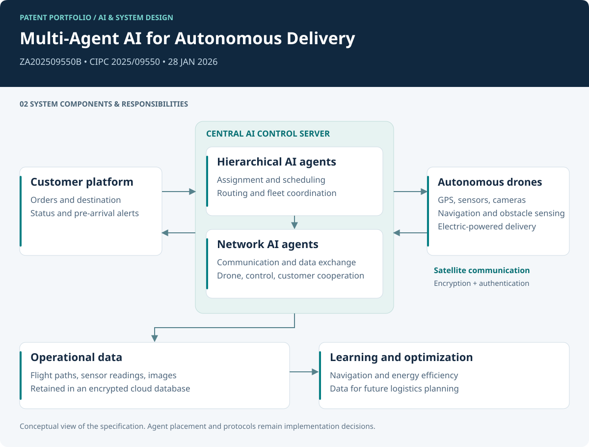
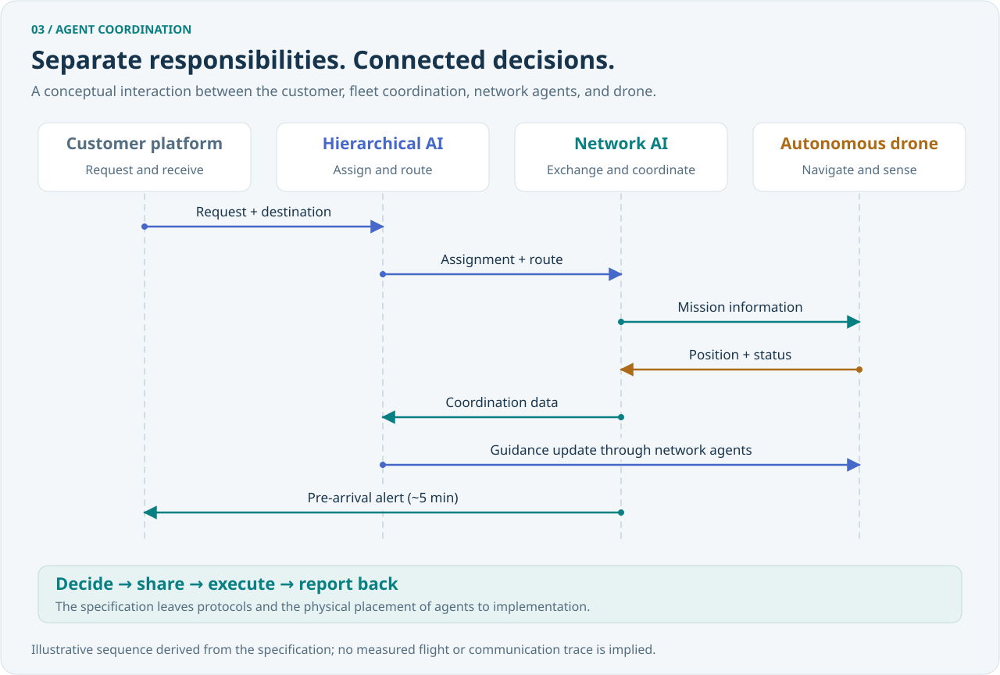
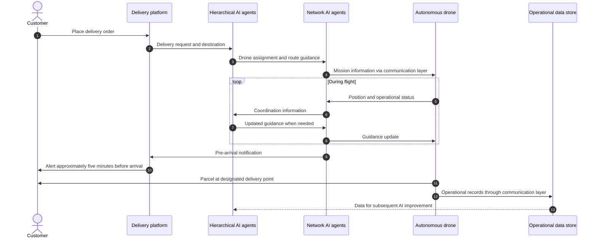
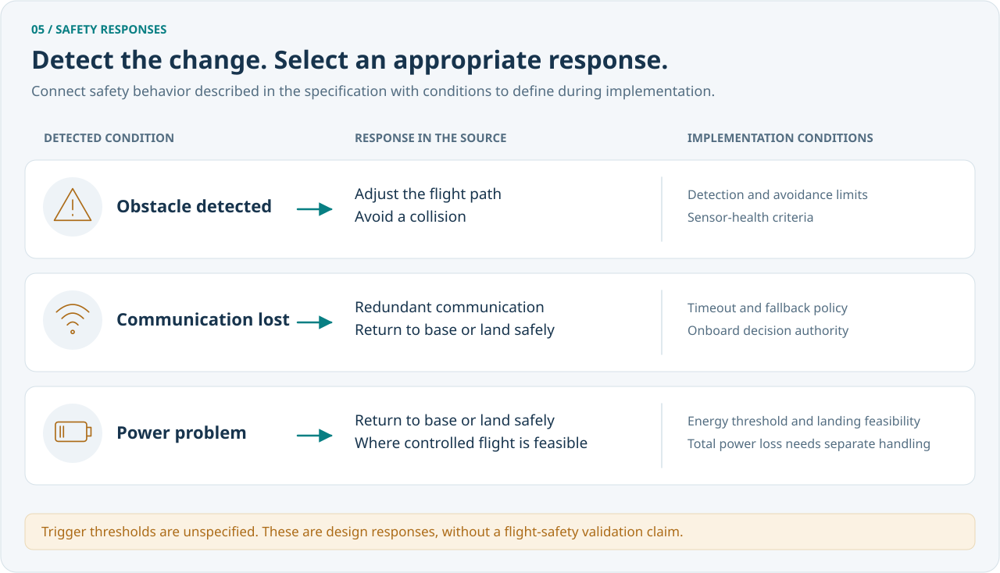
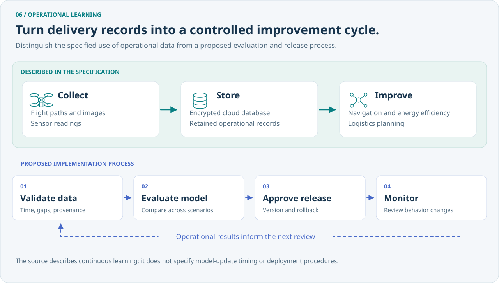

# System design analysis

[Portfolio](../README.md) · English | [日本語](system-design.ja.md)

## 1. Architectural intent

The supplied specification connects fleet-level scheduling with autonomous execution and continuous information exchange. Its organizing decision is the division between **hierarchical agents**, which coordinate the fleet, and **network agents**, which coordinate communication. GPS, onboard sensing, and satellite communication provide the information and connectivity used by the delivery workflow.

This document uses two explicit categories:

- **Source design:** behavior described in the supplied specification.
- **Implementation consideration:** an engineering proposal for making that behavior concrete. These proposals are portfolio analysis, not additional claims attributed to the original invention.

## 2. Responsibility boundaries

| Boundary | Source design | Implementation consideration |
|---|---|---|
| Platform → AI control | Receive orders and determine the customer location | Validate the destination and delivery-point eligibility before assignment; define when location updates may change a mission |
| Hierarchical agents → drone fleet | Select drones, schedule work, and optimize routes | Maintain one authoritative active assignment per drone and version route changes |
| Network agents ↔ participants | Exchange real-time information among drones, control center, and customers | Specify message ordering, duplicate handling, freshness, and recovery after disconnection |
| Drone sensors → navigation | Detect obstacles and adjust the flight path | Define onboard decision authority, sensor-health checks, and behavior when observations disagree |
| AI control → customer | Send a pre-arrival alert | Define ETA refresh, retry, deduplication, and delivery receipt for notifications |
| Operations → learning | Retain paths, images, and sensor readings for improvement | Validate datasets and candidate models before deploying an updated model |

## 3. An illustrative interaction sequence

The following diagram expands the source's delivery sequence. It is a conceptual view; it does not prescribe an API or establish the physical deployment location of an agent.

Actual storage ingestion and the component that calculates ETA are unspecified in the source. The diagram groups these interactions for readability.

## 4. Proposed information contracts

These example fields are implementation considerations, provided to make the architectural boundaries reviewable. They are not a shipped API.

| Record | Example fields | Reason |
|---|---|---|
| Delivery request | `request_id`, `destination`, `delivery_point_id` | Correlate an order with an intended handoff location |
| Mission assignment | `mission_id`, `drone_id`, `route_version`, `issued_at` | Identify the active mission and reject an obsolete route |
| Telemetry | `mission_id`, `observed_at`, `position`, `battery_state`, `sensor_health` | Assess freshness and the machine's ability to continue |
| Arrival notification | `mission_id`, `eta`, `notification_id`, `sent_at` | Avoid duplicated alerts and evaluate timing |
| Delivery record | `mission_id`, `outcome`, `completed_at`, `data_references` | Link the operational outcome to retained evidence |

Time sources, coordinate reference systems, units, access control, and schema evolution would need to be specified before implementation.

## 5. Failure handling

The source names communication redundancy, obstacle avoidance, monitoring, return to base, and safe landing. Implementation must define the conditions under which each response is feasible.

| Scenario | Source connection | Implementation consideration | Evidence to collect |
|---|---|---|---|
| Communication interruption | Redundant links; return or safe landing | Use a bounded communication timeout and a defined local fallback policy | Simulated link-loss timeline, chosen response, recovery behavior |
| Obstacle detected | Sensors and automatic route adjustment | Define minimum detection and avoidance performance for the intended environment | Scenario coverage, intervention count, avoidance outcome |
| Power problem | Return-to-base or safe-landing description | Specify low-energy thresholds and controlled-landing feasibility; complete power loss needs separate handling | Energy budget and controlled fault-injection results |
| Changing weather | Dynamic routing from weather/environment data | Establish conditions for rerouting, holding, or terminating a mission | Decision trace against predefined operating limits |
| Stale or duplicated command | Continuous coordination | Version assignments and make repeated messages safe to process | Message replay and out-of-order tests |
| Delivery point unavailable | Predefined drop-off location | Define handoff confirmation and an abort or alternate-site procedure | Delivery-point rejection and recovery cases |

The last two rows expand questions left open in the specification. No flight-safety validation results are included in the supplied material.

## 6. Security and operational data

**Source design:** encrypted and authenticated satellite communication, quantum-resistant cryptographic protocols, and encrypted cloud storage for images, sensor readings, and flight paths.

**Implementation considerations:**

- Identify authenticated endpoints, manage device keys, and define revocation and rotation.
- Select concrete cryptographic protocols and assess their computational and communication cost on the drone platform.
- Define how the system responds to unavailable or inconsistent positioning and communication inputs.
- Limit access to customer locations and camera data, and set retention and deletion rules.
- Record dataset and model versions so a change in navigation behavior can be traced to its inputs.

The specification does not identify a cryptographic suite, a tested threat model, or positioning-integrity mechanisms. Its security language is treated here as a set of design requirements.

## 7. Learning lifecycle

**Source design:** collect operational data, store it, and use it to improve navigation, energy efficiency, and predictive logistics planning.

**Proposed implementation sequence:**

1. Associate flight records with mission outcomes and sensor-health context.
2. Validate timestamps, missing observations, labels, and data provenance.
3. Separate training and evaluation data by mission and operating scenario.
4. Evaluate a candidate model against route, energy, and safety criteria.
5. Release approved versions with a rollback path and monitor subsequent behavior.

The source describes continuous learning but does not specify when or how updated models are deployed. This proposal makes that missing release boundary explicit.

## 8. Evaluation plan

The following is a proposed evaluation plan. Baselines, thresholds, datasets, and results have not been supplied.

| Question | Proposed measure | Evaluation approach |
|---|---|---|
| Does the system complete accepted work? | Successful deliveries / accepted missions; report rejection and cancellation separately | Scenario-based simulation followed by controlled trials |
| Does coordination adapt to change? | Replanning time and valid reassignment rate | Inject weather, availability, and route changes |
| Is the arrival alert useful? | Distribution of actual arrival time minus alert time | Compare delivery events with notification logs; inspect deviation from the approximately five-minute target |
| What is the energy cost? | Watt-hours / successful delivery, stratified by payload and route | Measure comparable missions and disclose operating conditions |
| How does communication recover? | Outage duration, recovery time, and fallback outcome | Controlled interruption and recovery scenarios |
| Are safety responses consistent? | Correct response rate per predefined fault scenario | Review fault-injection traces against explicit acceptance criteria |
| Are cost and emissions goals supported? | Cost / completed delivery; energy and emissions accounting under stated assumptions | Compare like-for-like routes, payloads, and service conditions |

No benchmark score is implied by inclusion in this plan. The source's cost reduction, delivery-fee elimination, and environmental benefits are aspirations that require operating and business evidence.

## 9. Design contribution

The case study demonstrates how a logistics problem can be expressed as interacting system responsibilities: fleet decisions, information exchange, autonomous execution, customer communication, and a data-improvement cycle. The contribution documented here is the invention and its system-level specification, with traceable links to the provided claims and description.
