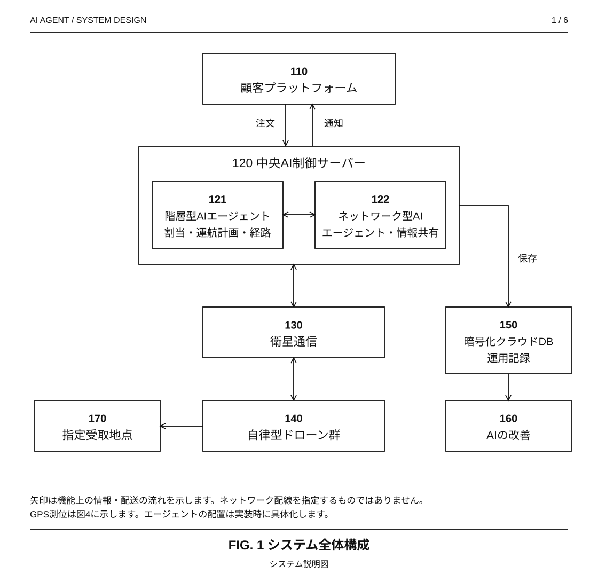
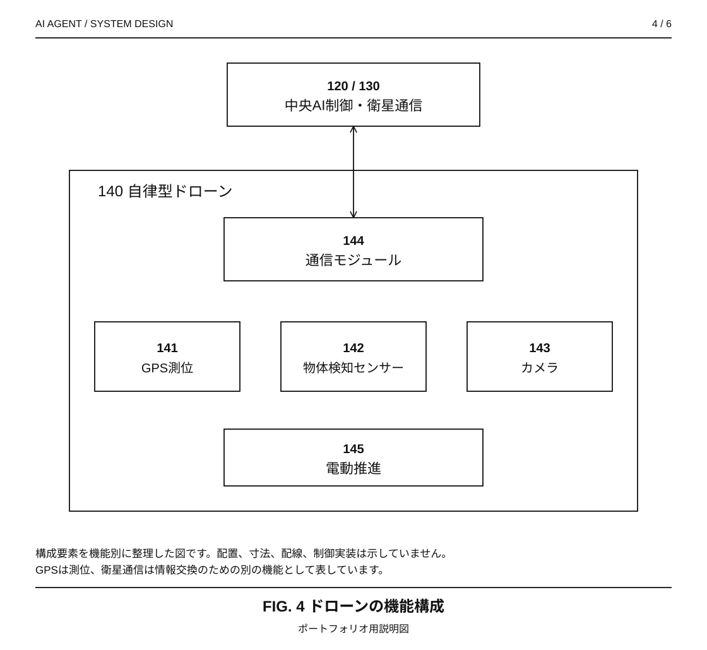
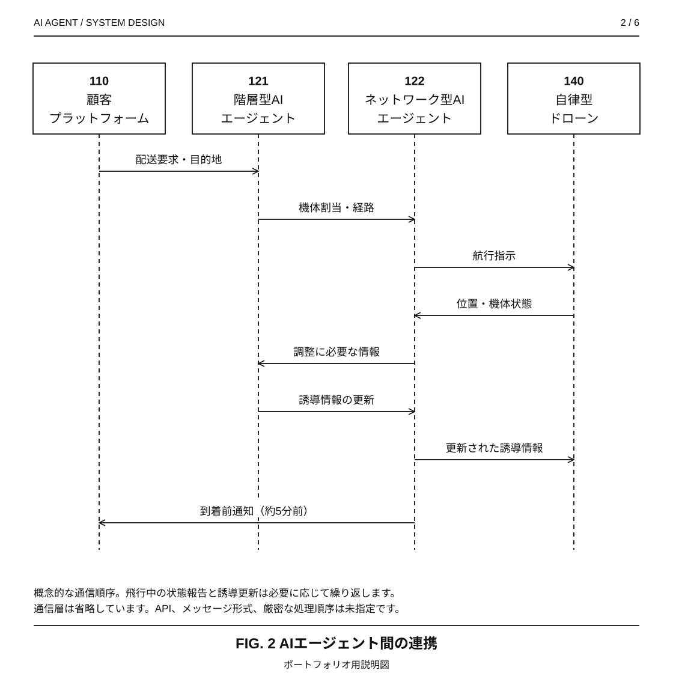
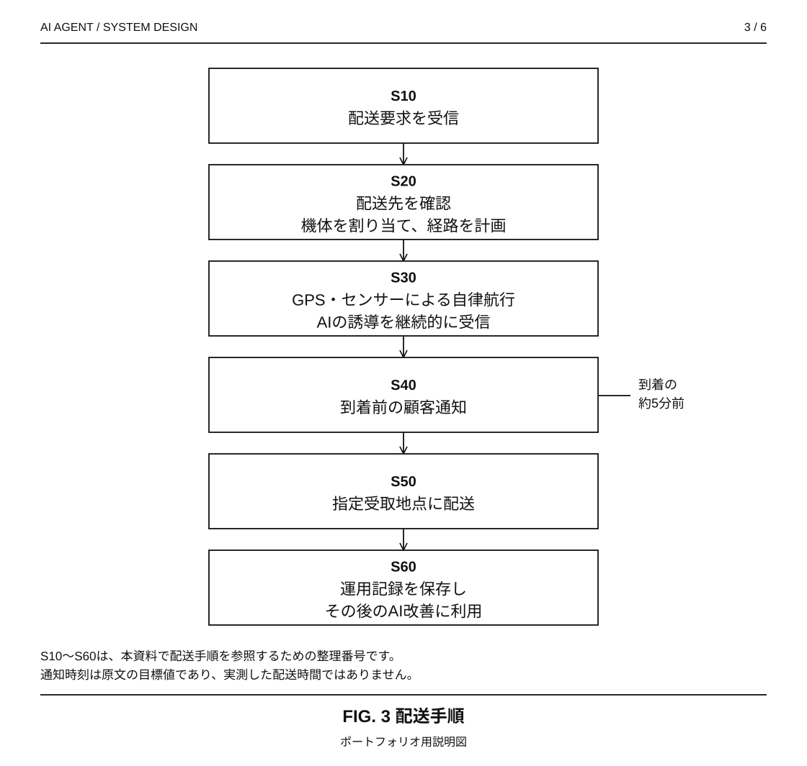
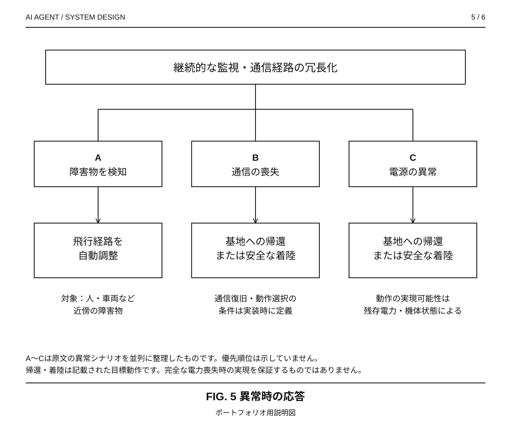
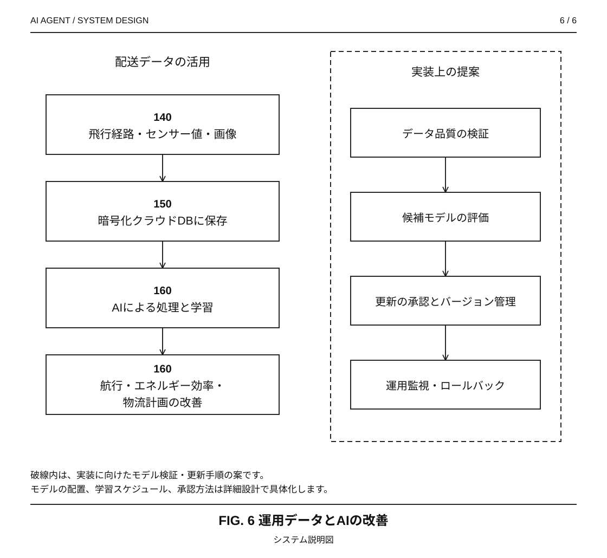

# AIエージェントとシステム設計

**自律型ドローン配送特許**

**言語:** [English](README.md) | 日本語

**登録特許 · CIPC 2025/09550 · 2026年1月28日**

*全6種の技術説明図を英語・日本語で掲載しています。[図面一覧と構成要素の符号](assets/README.md)。*

**図で理解する:** [システム構成](#system-architecture) · [エージェントの連携](#agent-coordination) · [配送フロー](#delivery-lifecycle) · [安全性と学習](#safety-learning)

## プロジェクト概要

マルチエージェントAIによる自律型ドローン配送システムを考案し、特許明細書を執筆しました。**2026年1月28日**に**CIPC**で特許登録され、公開番号は **ZA202509550B** です。

機体群の運航計画・経路選択と、ドローン・管制側・顧客間の情報共有を、別々のエージェントが担う構成にしました。これらを自律航行、到着前通知、飛行データを使ったAIの改善につなげています。

システム全体の構成、エージェントの役割、配送手順、通信要件、安全動作を設計しました。このリポジトリには、その内容を説明する図面、[システム設計](docs/system-design.ja.md)、[請求項との対応表](docs/claim-map.ja.md)、[特許明細書](source/specification.txt)をまとめています。

**主な技術領域:** マルチエージェントAI · システム設計 · 自律システム · 技術文書作成

## 登録特許

**正式名称（英語）:** Artificial Intelligence-Based Smart Drone Delivery System Using AI Multi-Agent Technology

**日本語参考訳:** AIマルチエージェント技術を用いた人工知能ベースのスマートドローン配送システム

| 特許情報 | 記録 |
|---|---|
| 登録機関 | CIPC |
| 特許番号 | 2025/09550 |
| 公開番号 | ZA202509550B |
| 出願日・優先日 | 2025年11月11日 |
| 登録日 | 2026年1月28日 |
| 公開日 | 2026年1月28日 |

## 発明の概要

| 項目 | 設計内容 |
|---|---|
| 用途 | 荷物の自律配送 |
| 想定地域 | 韓国、日本、中国 |
| 協調方式 | 階層型エージェントによる機体群の統括とネットワーク型エージェントによる連携 |
| 機体の機能 | GPS測位、センサー、カメラ、自律航行、電動推進 |
| 通信 | 暗号化・認証を用いた衛星通信 |
| 顧客体験 | 注文、位置情報に基づく機体割当、到着通知、指定地点での受け取り |
| データ活用 | 飛行経路、センサー値、画像の保存とAI改善への再利用 |
| 公開資料 | 技術ケーススタディ、構成図、明細書原文、請求項対応表 |

本プロジェクトは、発明の考案とシステム設計をまとめたものです。今後の実装に向けた評価計画を掲載しており、飛行試験結果や性能ベンチマークは含めていません。

## 課題と設計目標

機体群全体の計画を、各ドローンが直面する状況に合わせて調整することを重視しました。建物が密集する都市部、山間部、配送先が分散した地域では、この連携が特に重要になります。

| 設計目標 | 明細書に記載された仕組み | 期待する価値 |
|---|---|---|
| 機体群の調整 | 階層型エージェントによる割当、運航計画、経路決定 | 一貫した配車・運航管理 |
| 状況変化への適応 | 交通、気象、環境情報に応じた経路更新 | 変化に対応する航行 |
| 関係者間の情報共有 | ドローン、管制側、顧客間のネットワーク連携 | 配送状況の把握と協調運用 |
| 受け取りの予測可能性 | 到着約5分前のテキスト・アプリ通知 | 顧客の受け取り準備 |
| 配送可能地域の拡大 | 電動ドローンと指定受取地点 | 到達しにくい場所への配送手段 |
| 運用の継続的改善 | 運用データの蓄積と学習への利用 | 航行・物流計画の改善 |

これらの目標をどう検証するかは、[システム設計の評価計画](docs/system-design.ja.md#8-評価計画)にまとめています。

## マルチエージェント構成

中央AI制御サーバーに、相互補完的な二つのエージェントの役割を設けています。

| 構成要素 | 役割 | 主に扱う情報 |
|---|---|---|
| **階層型AIエージェント** | 機体群の統括、機体割当、運航計画、経路計画、全体調整 | 配送要求、空き機体、配送先、経路判断 |
| **ネットワーク型AIエージェント** | 機体間・管制側・顧客間の通信と情報共有 | 状態更新、連携情報、顧客向けメッセージ |
| **自律型ドローン** | 航行と配送の実行、障害物の検知、周辺状況への対応 | GPS座標、センサー値、画像、飛行状態 |
| **顧客プラットフォーム** | 注文受付、テキスト・アプリ通知 | 配送依頼、目的地、到着通知 |
| **運用データストア** | 暗号化されたクラウドDBへの保存とAI改善への利用 | 飛行経路、センサー値、画像 |

階層型エージェントは機体群の判断、ネットワーク型エージェントは情報交換を担当するように役割を分けました。プロセスの配置や通信プロトコルは、実装時に具体化する項目です。

<strong>図4 — ドローンの機能構成</strong>

符号141〜145は、測位、検知、通信、推進の各機能を示します。ハードウェアの詳細設計は、実装段階で具体化します。

### エージェントの連携

階層型エージェントは機体の割当と経路を決定し、ネットワーク型エージェントは関係者間の情報共有を担います。機体が位置と状態を報告することで、配送中の誘導を更新します。この図は、各役割と情報の流れを示しています。

### 配送ライフサイクル

1. **注文:** 顧客が接続された配送プラットフォームから注文します。
2. **割当:** AIが配送先を確認し、利用可能な機体と経路を決定します。
3. **航行:** ドローンがGPS、センサー、衛星通信を利用して飛行し、AIが状況に応じて誘導を更新します。
4. **通知:** 到着の約5分前に、テキストまたはアプリで顧客に通知します。
5. **配送:** 地上の配送区画や指定された窓など、事前に定めた場所で荷物を受け渡します。
6. **学習:** 飛行経路、センサー値、画像を蓄積し、航行精度、エネルギー効率、物流計画の改善に利用します。

到着の約5分前に通知し、顧客が受け取りを準備できるようにする想定です。荷物の解放機構と受取人の確認方式は、詳細設計で検討する項目です。

## 設計判断とトレードオフ

| 設計判断 | 意義 | 実装時に具体化する点 |
|---|---|---|
| 機体群の統括とネットワーク連携を分離 | 配車と通信の責任を明確化 | 競合する指示や古い指示の扱い |
| 中央の誘導と機体側の検知を組み合わせる | 全体最適と局所的な障害物対応を接続 | 通信断時に機体側で継続する判断 |
| 衛星通信を組み込む | 通信基盤を配送設計の一部として扱う | 通信範囲、遅延、電力、冗長性の予算 |
| 運用データを再利用する | 運用とモデル改善を接続 | データ品質、モデル評価、更新管理 |
| 指定受取地点を設ける | 航行と顧客への引き渡しを接続 | 荷物の解放前に行う受取地点の安全確認 |

これらの実装上の課題は、[システム設計](docs/system-design.ja.md)で詳しく検討しています。

## 安全性・セキュリティ・学習

- **安全動作:** 継続的な監視、障害物の検知・回避、通信経路の冗長化、電源・通信異常時の帰還または安全な着陸。
- **通信要件:** 暗号化、認証、耐量子暗号プロトコル。具体的なプロトコルの選定、鍵管理、セキュリティ試験は実装段階で進める項目です。
- **データ処理:** 画像、センサー値、飛行経路を暗号化クラウドDBに保存し、AI改善に再利用します。
- **評価の優先項目:** 配送完了、経路変更、通知時刻、配送成功1件当たりの消費電力量、通信復旧、安全動作。[評価計画](docs/system-design.ja.md#8-評価計画)に指標と試験シナリオをまとめています。

<strong>運用データと学習サイクルを見る</strong>

左列は、配送データをAIの改善につなげる流れです。右側には、実装に向けた提案として、データ検証、モデル評価、更新承認、運用監視の手順をまとめました。詳しくは[システム設計](docs/system-design.ja.md)を参照してください。

## 請求項と技術構成の対応

請求項は、配送システムの基本構成と、それに付随する四つの機能を扱っています。C1〜C5は、[明細書](source/specification.txt)の各記述を参照するための番号です。

| 整理番号 | 対象 | 対応する構成 |
|---|---|---|
| C1 | GPS・センサー・通信モジュール付きドローンと、衛星通信によるAI配送管理 | 機体群とAI制御系 |
| C2 | 階層型エージェントによる運航計画・経路調整 | 機体群の統括 |
| C3 | ネットワーク型エージェントによる機体・顧客間のリアルタイム通信 | ネットワーク連携と顧客接点 |
| C4 | 到着前の自動通知 | 顧客通知フロー |
| C5 | 運用データの改善への利用と電動機体 | 学習サイクルと機体基盤 |

[請求項対応表](docs/claim-map.ja.md)では、各機能と明細書の記述箇所を対応付けています。

## 応用先

医療物資の輸送、災害時の救援物流、エアタクシーなどの将来の交通システムへの応用も検討しました。それぞれの用途に合わせた運用要件の設計と検証が必要になります。

## ドキュメント

| 資料 | English | 日本語 |
|---|---|---|
| ポートフォリオ概要 | [Overview](README.md) | 本ページ |
| システム設計・評価計画 | [System design](docs/system-design.md) | [システム設計](docs/system-design.ja.md) |
| 請求項と設計の対応 | [Claim map](docs/claim-map.md) | [請求項対応表](docs/claim-map.ja.md) |
| 特許情報・出典 | [Patent record](docs/patent-record.md) | [特許情報](docs/patent-record.ja.md) |
| 特許明細書 | [Original English text](source/specification.txt) | 英語原文を参照 |

## 図面について

システムの構成と動作を説明するため、図面を作成しました。正式な特許図面とは別の説明図です。全6種の図と構成要素の符号は、[図面一覧](assets/README.md)にまとめています。

本リポジトリの公開によって、ソフトウェアや特許の利用許諾を行うものではありません。
