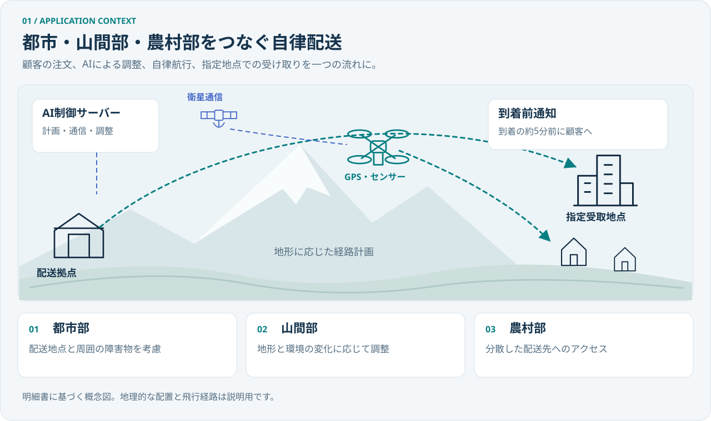
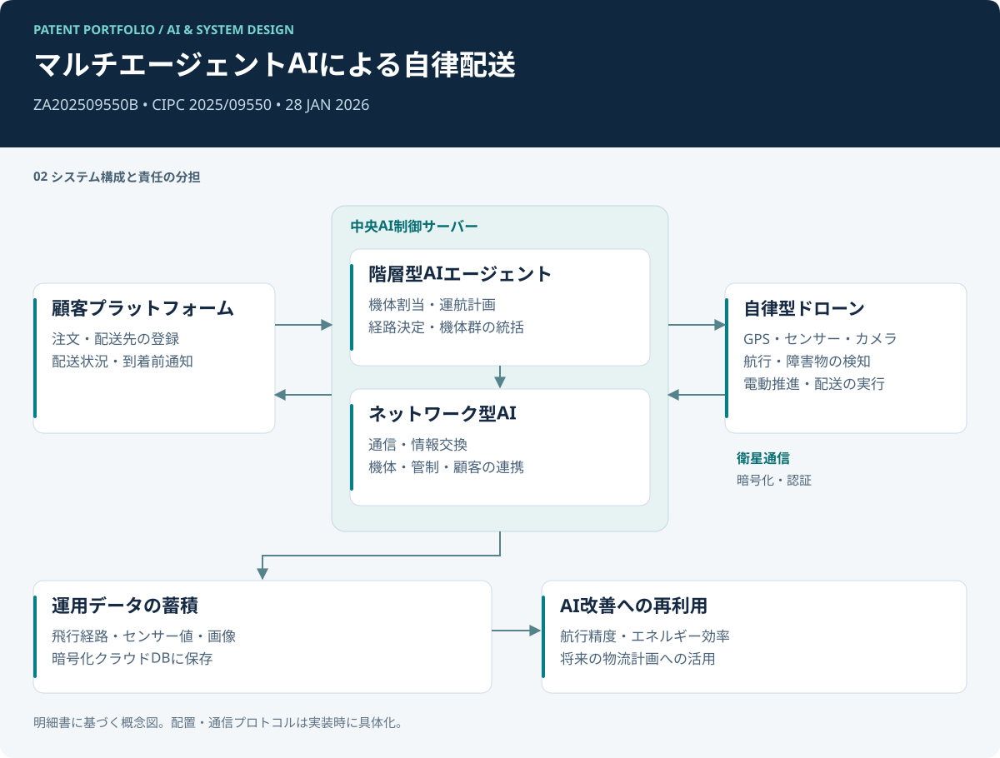
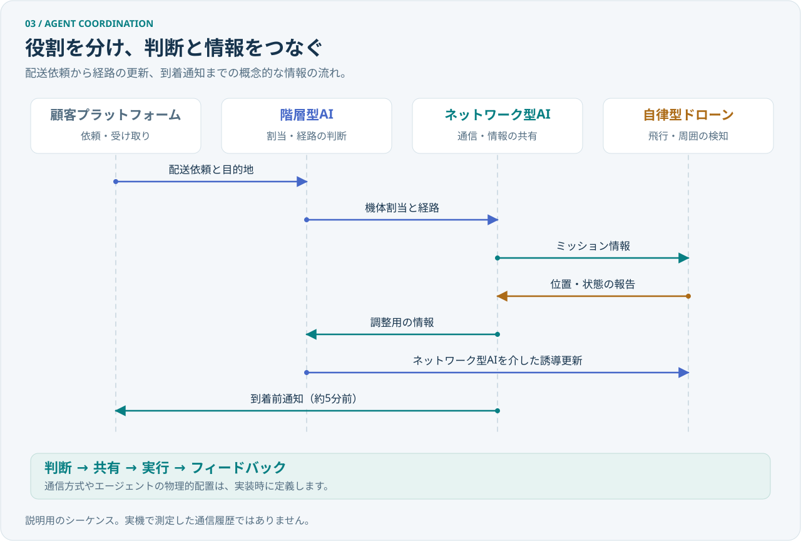
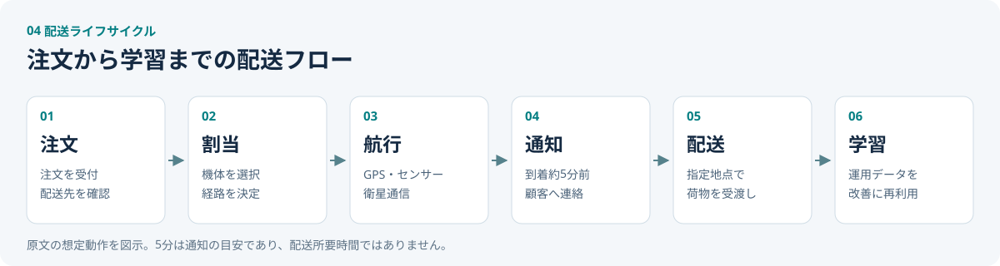
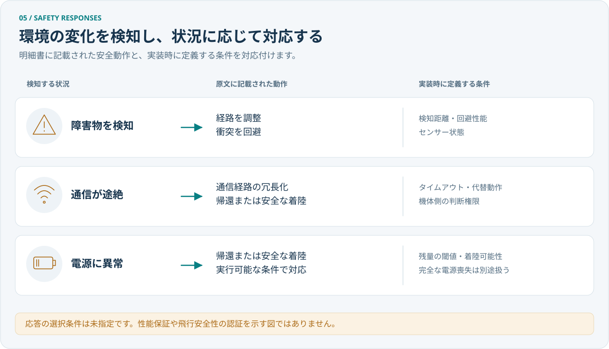
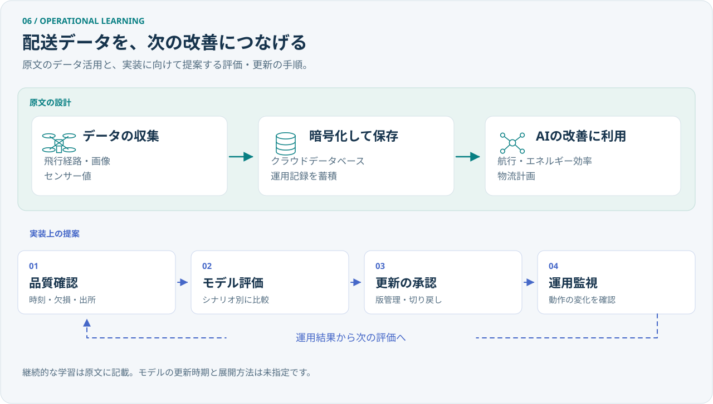

# 自律型ドローン配送のためのマルチエージェントAI

**言語:** [English](README.md) | 日本語

**登録特許 · 南アフリカ共和国 · CIPC 2025/09550 · 2026年1月28日**

**図で理解する:** [システム構成](#system-architecture) · [エージェントの連携](#agent-coordination) · [配送フロー](#delivery-lifecycle) · [安全性と学習](#safety-learning)

## プロジェクト概要

- **課題:** 都市部、山間部、地理的に分散した地域での配送には、機体群の調整、状況に応じた経路変更、継続的な通信、円滑な荷物の受け渡しが必要です。
- **設計したもの:** 配車・経路計画を担う階層型AIエージェントと、通信・情報共有を担うネットワーク型AIエージェントを組み合わせ、GPS、センサー、カメラ、通信モジュールを備えたドローンによる自律配送システムを設計しました。
- **成果:** マルチエージェントAI、自律航行、到着通知、運用データの再利用を一つのシステムとしてまとめ、特許 **ZA202509550B** を取得しました。公開日は **2026年1月28日** です。詳細は[特許情報](docs/patent-record.ja.md)に記載しています。
- **担当範囲:** 発明の考案と明細書の執筆を担当し、エージェントの役割、配送フロー、通信要件、安全動作、応用先を定義しました。
- **確認方法:** 以下の構成図から、[システム設計](docs/system-design.ja.md)、[請求項と設計の対応](docs/claim-map.ja.md)、[提供された明細書原文](source/specification.txt)へ進めます。

**専門領域:** マルチエージェント設計 · 自律システム · システム設計 · 発明の考案 · 技術文書作成

## 登録特許

**正式名称（英語）:** Artificial Intelligence-Based Smart Drone Delivery System Using AI Multi-Agent Technology

**日本語参考訳:** AIマルチエージェント技術を用いた人工知能ベースのスマートドローン配送システム

| 特許情報 | 記録 |
|---|---|
| 管轄・登録国 | CIPC · 南アフリカ共和国 |
| 特許番号 | 2025/09550 |
| 公開番号 | ZA202509550B |
| 出願日・優先日 | 2025年11月11日 |
| 特許査定・登録日 | 2026年1月28日（発明者提供情報） |
| 公開日 | 2026年1月28日（Google Patents掲載情報） |

## 発明の概要

| 項目 | 設計内容 |
|---|---|
| 用途 | 荷物の自律配送 |
| 想定地域 | 韓国、日本、中国 |
| 協調方式 | 階層型エージェントによる機体群の統括とネットワーク型エージェントによる連携 |
| 機体の機能 | GPS測位、センサー、カメラ、自律航行、電動推進 |
| 通信 | 暗号化・認証を用いた衛星通信 |
| 顧客体験 | 注文、位置情報に基づく機体割当、到着通知、指定地点での受け取り |
| データ活用 | 飛行経路、センサー値、画像の保存とAI改善への再利用 |
| 公開資料 | 技術ケーススタディ、構成図、明細書原文、請求項対応表 |

提供資料は、発明の構成と想定動作を説明するものです。飛行実証、稼働ソフトウェア、コスト・排出量の実測結果は、本ポートフォリオの根拠資料には含まれていません。

## 課題と設計目標

明細書は、都市部、山間部・農村部、配送先が分散した地域における物流を、複数の機体と関係者の調整という観点から捉えています。機体群全体の判断と、各ドローンが遭遇する現場の状況を接続することが設計の中心です。

| 設計目標 | 明細書に記載された仕組み | 期待する価値 |
|---|---|---|
| 機体群の調整 | 階層型エージェントによる割当、運航計画、経路決定 | 一貫した配車・運航管理 |
| 状況変化への適応 | 交通、気象、環境情報に応じた経路更新 | 変化に対応する航行 |
| 関係者間の情報共有 | ドローン、管制側、顧客間のネットワーク連携 | 配送状況の把握と協調運用 |
| 受け取りの予測可能性 | 到着約5分前のテキスト・アプリ通知 | 顧客の受け取り準備 |
| 配送可能地域の拡大 | 電動ドローンと指定受取地点 | 到達しにくい場所への配送手段 |
| 運用の継続的改善 | 運用データの蓄積と学習への利用 | 航行・物流計画の改善 |

これらは設計上の目標です。運用上の効果は、実装後の測定によって評価する必要があります。

## マルチエージェント構成

中央AI制御サーバーに、相互補完的な二つのエージェントの役割を設けています。

| 構成要素 | 役割 | 主に扱う情報 |
|---|---|---|
| **階層型AIエージェント** | 機体群の統括、機体割当、運航計画、経路計画、全体調整 | 配送要求、空き機体、配送先、経路判断 |
| **ネットワーク型AIエージェント** | 機体間・管制側・顧客間の通信と情報共有 | 状態更新、連携情報、顧客向けメッセージ |
| **自律型ドローン** | 航行と配送の実行、障害物の検知、周辺状況への対応 | GPS座標、センサー値、画像、飛行状態 |
| **顧客プラットフォーム** | 注文受付、テキスト・アプリ通知 | 配送依頼、目的地、到着通知 |
| **運用データストア** | 暗号化されたクラウドDBへの保存とAI改善への利用 | 飛行経路、センサー値、画像 |

二つのエージェント区分は役割を表します。プロセスの配置、通信プロトコル、完全分散型の合意形成方式は明細書では定義されていません。また、本資料におけるマルチエージェントAIは自律物流の構成を指し、LLMフレームワークは指定されていません。

### エージェントの連携

階層型エージェントは機体の割当と経路を決定し、ネットワーク型エージェントは関係者間の情報共有を担います。機体が位置と状態を報告することで、配送中の誘導を更新します。この図は、各役割と情報の流れを示しています。

### 配送ライフサイクル

1. **注文:** 顧客が接続された配送プラットフォームから注文します。
2. **割当:** AIが配送先を確認し、利用可能な機体と経路を決定します。
3. **航行:** ドローンがGPS、センサー、衛星通信を利用して飛行し、AIが状況に応じて誘導を更新します。
4. **通知:** 到着の約5分前に、テキストまたはアプリで顧客に通知します。
5. **配送:** 地上の配送区画や指定された窓など、事前に定めた場所で荷物を受け渡します。
6. **学習:** 飛行経路、センサー値、画像を蓄積し、航行精度、エネルギー効率、物流計画の改善に利用します。

「約5分前」は通知タイミングの目標であり、配送所要時間の実測値ではありません。荷物の物理的な受け渡し機構と受取人の確認方式は記載されていません。

## 設計判断とトレードオフ

| 設計判断 | 意義 | 実装時に具体化する点 |
|---|---|---|
| 機体群の統括とネットワーク連携を分離 | 配車と通信の責任を明確化 | 競合する指示や古い指示の扱い |
| 中央の誘導と機体側の検知を組み合わせる | 全体最適と局所的な障害物対応を接続 | 通信断時に機体側で継続する判断 |
| 衛星通信を組み込む | 通信基盤を配送設計の一部として扱う | 通信範囲、遅延、電力、冗長性の予算 |
| 運用データを再利用する | 運用とモデル改善を接続 | データ品質、モデル評価、更新管理 |
| 指定受取地点を設ける | 航行と顧客への引き渡しを接続 | 荷物の解放前に行う受取地点の安全確認 |

詳細は[システム設計](docs/system-design.ja.md)に記載しています。原文の記述と、実装に向けた追加の検討事項を区別しています。

## 安全性・セキュリティ・学習

- **記載された安全動作:** 継続的な監視、障害物の検知・回避、通信経路の冗長化、電源・通信異常時の帰還または安全な着陸。
- **記載された通信要件:** 暗号化、認証、耐量子暗号プロトコル。具体的なアルゴリズム、鍵管理手順、セキュリティ試験結果は指定されていません。
- **記載されたデータ処理:** 画像、センサー値、飛行経路を暗号化クラウドDBに保存し、AI改善に再利用します。
- **評価の優先項目:** 配送完了、経路変更、通知時刻、配送成功1件当たりの消費電力量、通信復旧、安全動作。詳細文書では、未測定の数値を置かずに評価方法を提案しています。

<strong>運用データと学習サイクルを見る</strong>

上段は明細書に記載されたデータ活用です。下段はデータ検証、モデル評価、更新承認、運用監視という実装上の提案を示します。評価計画の詳細は[システム設計](docs/system-design.ja.md)を参照してください。

## 請求項と技術構成の対応

提供された請求項には、基本構成と四つの従属的な記述があります。以下のC1〜C5は読みやすさのための整理番号です。原文はそのまま保存しています。

| 整理番号 | 対象 | 対応する構成 |
|---|---|---|
| C1 | GPS・センサー・通信モジュール付きドローンと、衛星通信によるAI配送管理 | 機体群とAI制御系 |
| C2 | 階層型エージェントによる運航計画・経路調整 | 機体群の統括 |
| C3 | ネットワーク型エージェントによる機体・顧客間のリアルタイム通信 | ネットワーク連携と顧客接点 |
| C4 | 到着前の自動通知 | 顧客通知フロー |
| C5 | 運用データの改善への利用と電動機体 | 学習サイクルと機体基盤 |

記述箇所と詳細な対応は[請求項対応表](docs/claim-map.ja.md)を参照してください。説明本文にある機能と、提供された請求項に明示された構成を区別しています。

## 応用先

明細書では、医療物資の輸送、災害救援物流、エアタクシーを含む将来の交通システムを応用先として挙げています。いずれも原文で提案された方向性であり、用途ごとの運用要件と検証が必要です。

## ドキュメント

| 資料 | English | 日本語 |
|---|---|---|
| ポートフォリオ概要 | [Overview](README.md) | 本ページ |
| システム設計・評価計画 | [System design](docs/system-design.md) | [システム設計](docs/system-design.ja.md) |
| 請求項と設計の対応 | [Claim map](docs/claim-map.md) | [請求項対応表](docs/claim-map.ja.md) |
| 特許情報・出典 | [Patent record](docs/patent-record.md) | [特許情報](docs/patent-record.ja.md) |
| 提供された明細書 | [Original English text](source/specification.txt) | 英語原文を参照 |

## 公開資料の位置づけ

本リポジトリは、提供された明細書に基づく技術ポートフォリオです。図は本ケーススタディ用に作成した説明図で、日本語文書はポートフォリオ向けの翻訳です。公開書誌情報と日付の出典は[特許情報](docs/patent-record.ja.md)に記載しています。本公開にソフトウェアまたは特許のライセンスは含めていません。
